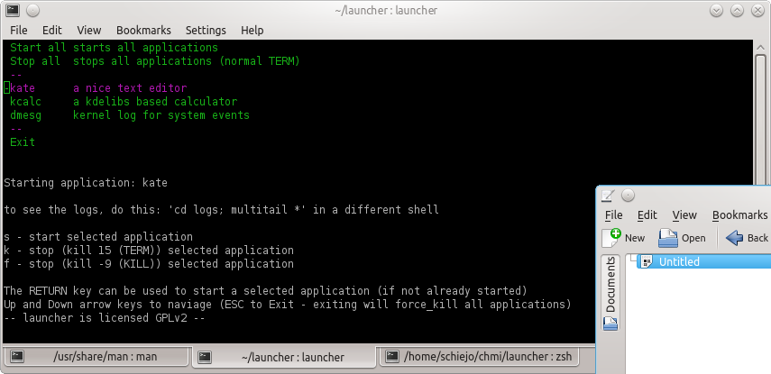

 launcher
=============================
launcher is a ncurses based simple c/c++ tool to launch and control a list of programs

the concept is to be able to control dependencies between programs when developing several programs.

target audience 
============================
the launcher tool was used during development and is designed for developers

* not all syscalls have error handlers
* sometimes program starts might get your console into a state which is not even cured by typing 'reset'

how to use
============================
you need to:
* modify lauchner.cpp, see the 3 examples there and consider the WARNING message above them
* compile the program
* create the 'logs' directory
* use multitail in parallel to launcher

author
============================
joachim schiele <js@lastlog.de>

copyright
============================
this tool is licensed GPLv2
